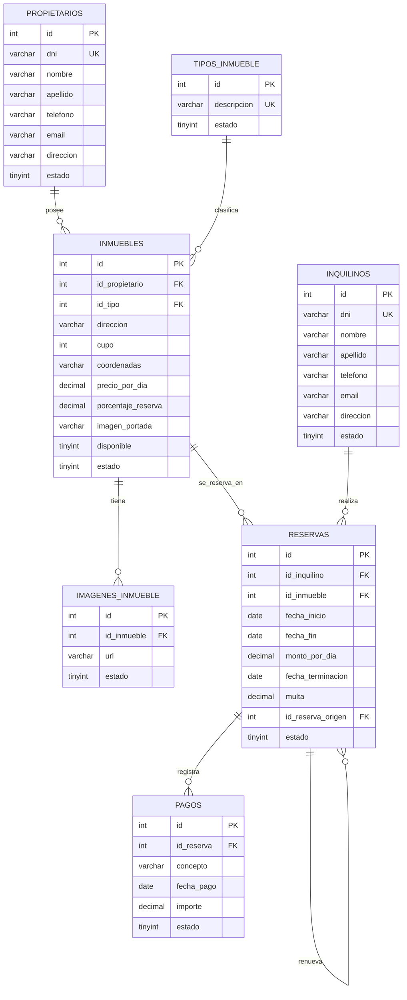

# Proyecto Reservas Temporales

Proyecto para gestionar alquileres temporarios de inmuebles de una inmobiliaria.

## Integrantes del Grupo

- Nahuel Vargas -
- Esteban Redon -
- Segura Luis -

## Base de Datos

La base de datos se llama `Lab2Inmobiliaria2026`.

El script esta en `database.sql`.

## Primera Etapa

Por ahora vamos a trabajar con las entidades principales, sin login, roles ni auditoria.

Entidades:

- Propietarios
- Tipos de inmueble
- Inmuebles
- Imagenes de inmueble
- Inquilinos
- Reservas
- Pagos

## Para Mas Adelante

Queda pendiente para otra etapa:

- Usuarios
- Login
- Roles de administrador y empleado
- Auditoria de reservas y pagos
- Reportes avanzados
- Renovacion de reservas
- Finalizacion anticipada con multa

## Tecnologias

- ASP.NET Core MVC
- C#
- MySQL/MariaDB
