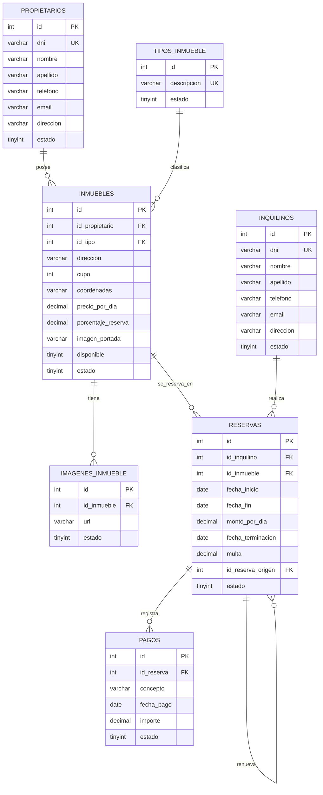

# Proyecto Reservas Temporales

Proyecto para gestionar alquileres temporarios de inmuebles de una inmobiliaria.

## Integrantes del Grupo

- Nahuel Vargas -
- Esteban Redon -
- Segura Luis -

## Base de Datos

La base de datos se llama `Lab2Inmobiliaria2026`.

El script esta en `database.sql`.

Para crear la base de datos desde MySQL/MariaDB:

```bash
mysql -u root -p < database.sql
```

## Instalacion y Ejecucion

Requisitos:

- .NET 8 SDK
- MySQL o MariaDB

Instalar/restaurar dependencias del proyecto:

```bash
dotnet restore
```

Compilar:

```bash
dotnet build
```

Correr la aplicacion:

```bash
dotnet run
```

Tambien se puede correr con recarga automatica durante desarrollo:

```bash
dotnet watch run
```

Nota: este proyecto es ASP.NET Core MVC, no usa `npm run dev`.



## Acceso, usuarios y perfil
Administrador:
Usuario: admi@gmail.com 
pass: administrador123


Empleados: 
Usuario:esteban@gmail.com
pass:esteban123

Usuario:luis@gmail.com 
pass:gabriel333

Usuario:nahu@gmail.com 
pass:nahuel1234


### Primer inicio sobre una base existente

1. Iniciar MySQL y comprobar `ConnectionStrings:DefaultConnection` en la configuración. La base debe existir.
2. Desde la carpeta del proyecto, ejecutar:

   ```powershell
   dotnet run --no-launch-profile -- --crear-admin
   ```

   El comando crea únicamente la tabla `usuarios` si falta, pide nombre, apellido, email y contraseña (10 a 128 caracteres) y crea el primer administrador. La contraseña no se muestra en una terminal interactiva. No altera inmuebles, reservas ni otras tablas. Si ya existe un administrador activo, no crea otro ni cambia sus credenciales.

3. Iniciar la aplicación:

   ```powershell
   dotnet run --launch-profile https
   ```

4. Ingresar con la cuenta creada. Desde **Usuarios**, el administrador puede crear las cuentas de los empleados y de otros administradores.

No hay cuentas ni contraseñas predeterminadas. Para una base existente **no es necesario volver a ejecutar `database.sql`**. La migración aditiva está en `Database/001_usuarios.sql` y el comando anterior la aplica automáticamente. El script completo también incluye esa tabla para instalaciones nuevas.

### Permisos

| Acción | Empleado | Administrador |
|---|---|---|
| Consultar, crear y editar entidades del negocio | Sí | Sí |
| Eliminar entidades | No | Sí |
| Listar, crear, editar o dar de baja otros usuarios | No | Sí |
| Cambiar sus propios datos, email, contraseña y avatar | Sí | Sí |

Los permisos se verifican en el servidor, además de ocultar los botones correspondientes. Las bajas de usuarios son lógicas y revocan sus sesiones. No se permite darse de baja a uno mismo ni dejar el sistema sin administradores. Para modificar datos propios se utiliza **Mi perfil**, sin posibilidad de cambiar el rol desde ese formulario.

### Contraseñas, sesiones y avatar

- Las contraseñas se almacenan con el hash de `PasswordHasher` de ASP.NET Core; nunca en texto plano.
- El cambio de contraseña exige la actual y cierra todas las sesiones. El cambio administrativo de un usuario también invalida sus sesiones anteriores.
- Las operaciones de escritura usan protección antifalsificación. El login admite hasta 10 intentos por minuto y dirección IP.
- Las cookies son HTTP-only y requieren HTTPS fuera de desarrollo. En despliegues detrás de un proxy, configurar correctamente HTTPS antes de habilitar el acceso.
- El avatar acepta archivos PNG, JPEG o WebP de hasta 2 MB; se comprueba su firma y se asigna un nombre generado por el servidor. No se acepta SVG.
- Los avatares se guardan en `App_Data/avatares`, fuera de los archivos públicos. La aplicación necesita permiso de escritura allí. Esta carpeta no se versiona y debe preservarse al desplegar o hacer copias de seguridad.

### Pruebas

Pruebas HTTP de acceso, permisos, perfil, sesiones y avatares, con usuarios en memoria:

```powershell
dotnet test tests/Inmobiliaria.Tests/Inmobiliaria.Tests.csproj
```

Para incluir la prueba de persistencia, migración y protección del último administrador en MySQL:

```powershell
$env:INMOBILIARIA_TEST_MYSQL = '1'
dotnet test tests/Inmobiliaria.Tests/Inmobiliaria.Tests.csproj
Remove-Item Env:INMOBILIARIA_TEST_MYSQL
```

Ejecutar desde la raíz del proyecto. La prueba de MySQL usa la conexión configurada para crear una base temporal con nombre `inmobiliaria_test_...`, y elimina únicamente esa base al terminar. Requiere permisos para crear y eliminar bases de prueba; nunca modifica la base de la inmobiliaria.

## Para Mas Adelante

Queda pendiente para otra etapa:

- Gestión de pagos e imágenes adicionales de inmuebles
- Auditoria de reservas y pagos
- Reportes avanzados
- Renovacion de reservas
- Finalizacion anticipada con multa

## Tecnologias

- ASP.NET Core MVC
- C#
- MySQL/MariaDB
