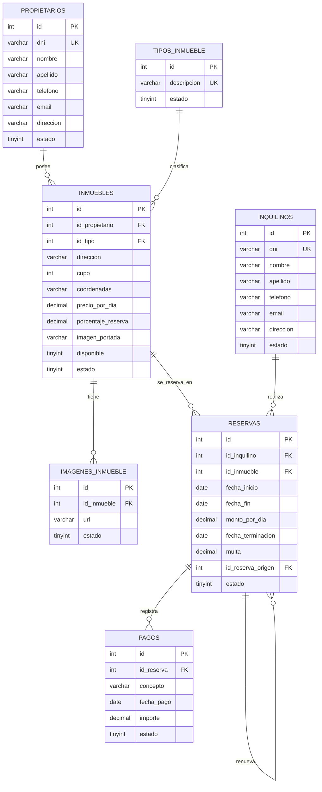

# Proyecto Reservas Temporales

Proyecto para gestionar alquileres temporarios de inmuebles de una inmobiliaria.

## Integrantes del Grupo

- Nahuel Vargas -
- Esteban Redon -
- Segura Luis -

## Base de Datos

La base de datos se llama `Lab2Inmobiliaria2026`.

El script esta en `database.sql`.

Para crear la base de datos desde MySQL/MariaDB:

```bash
mysql -u root -p < database.sql
```

## Instalacion y Ejecucion

Requisitos:

- .NET 8 SDK
- MySQL o MariaDB

Instalar/restaurar dependencias del proyecto:

```bash
dotnet restore
```

Compilar:

```bash
dotnet build
```

Correr la aplicacion:

```bash
dotnet run
```

Tambien se puede correr con recarga automatica durante desarrollo:

```bash
dotnet watch run
```

Nota: este proyecto es ASP.NET Core MVC, no usa `npm run dev`.



## Acceso, usuarios y perfil
Administrador:
Usuario: admi@gmail.com 
pass: administrador123


Empleados: 
Usuario:esteban@gmail.com
pass:esteban123

Usuario:luis@gmail.com 
pass:gabriel333

Usuario:nahu@gmail.com 
pass:nahuel1234


### Contraseñas, sesiones y avatar

- Las contraseñas se almacenan con el hash de `PasswordHasher` de ASP.NET Core; nunca en texto plano.
- El cambio de contraseña exige la actual y cierra todas las sesiones. El cambio administrativo de un usuario también invalida sus sesiones anteriores.
- Las operaciones de escritura usan protección antifalsificación. El login admite hasta 10 intentos por minuto y dirección IP.
- Las cookies son HTTP-only y requieren HTTPS fuera de desarrollo. En despliegues detrás de un proxy, configurar correctamente HTTPS antes de habilitar el acceso.
- El avatar acepta archivos PNG, JPEG o WebP de hasta 2 MB; se comprueba su firma y se asigna un nombre generado por el servidor. No se acepta SVG.
- Los avatares se guardan en `App_Data/avatares`, fuera de los archivos públicos. La aplicación necesita permiso de escritura allí. Esta carpeta no se versiona y debe preservarse al desplegar o hacer copias de seguridad.


## Para Mas Adelante

Queda pendiente para otra etapa:

- Imágenes adicionales de inmuebles
- Auditoría de reservas
- Conectar la seña inicial al formulario de creación de reservas
- Reportes avanzados
- Renovacion de reservas
- Finalizacion anticipada con multa

## Tecnologias

- ASP.NET Core MVC
- C#
- MySQL/MariaDB
